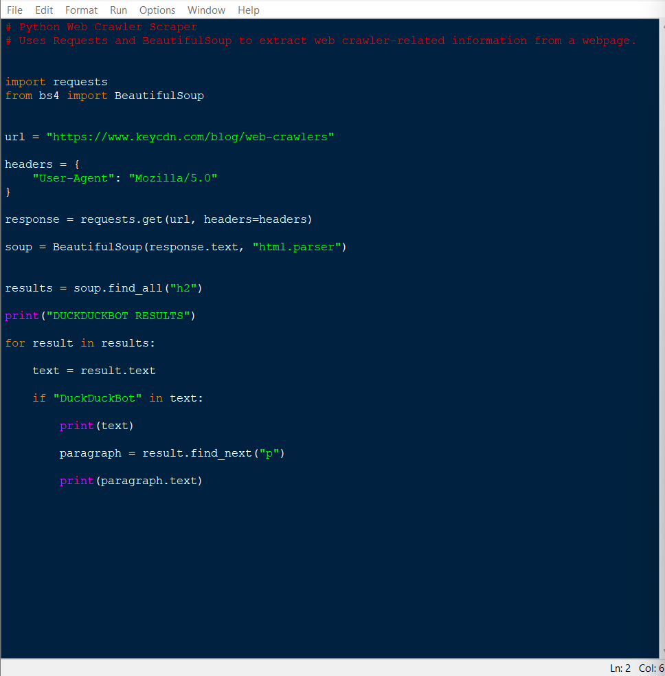
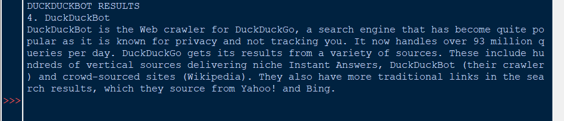

# Python Web Crawler Scraper

This project is a Python web scraping project that uses Requests and BeautifulSoup to retrieve webpage HTML, parse headings, and extract web crawler-related information from a webpage.

The scraper connects to a webpage about web crawlers and extracts the section related to DuckDuckBot.

## Features

- Sends an HTTP request to a webpage
- Uses a custom User-Agent header
- Parses HTML with BeautifulSoup
- Finds webpage headings
- Extracts and prints DuckDuckBot-related information
- Displays output in the Python IDLE shell

## Technologies Used

- Python
- Requests
- BeautifulSoup
- HTML parsing
- Web scraping

## Project Structure

Python-Web-Crawler-Scraper/
- README.md
- scrapers/
  - web_crawler_scraper.py
- screenshots/
  - 1_Web_Crawler_Code.png
  - 2_Web_Crawler_Output.png

## Screenshots

### Web Crawler Code

### Web Crawler Output

## Skills Demonstrated

- Python scripting
- Web scraping
- HTML parsing
- Using external libraries
- Reading webpage content
- Displaying structured output